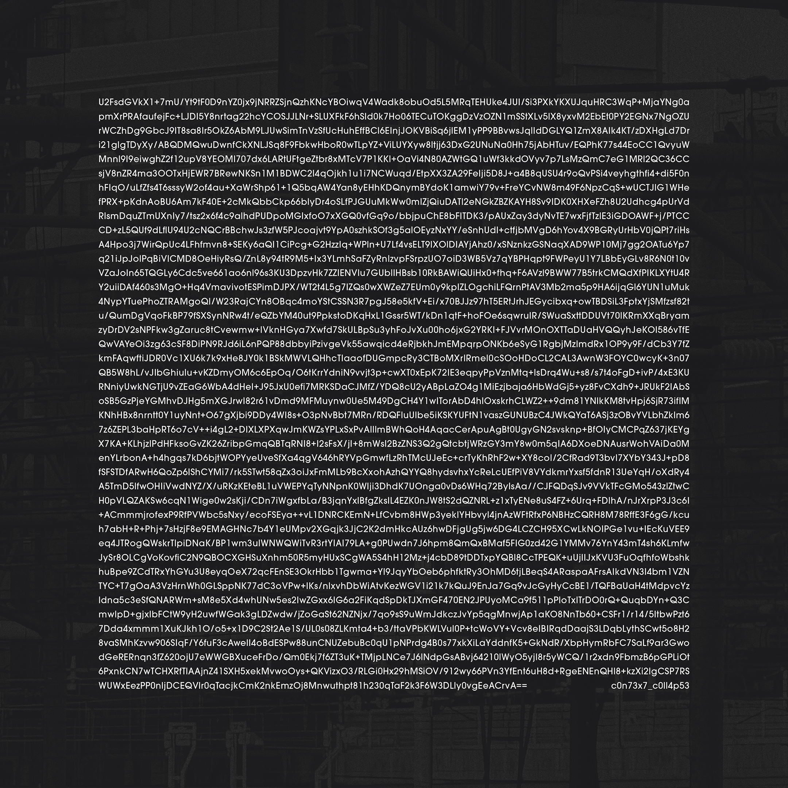

# c0n73x7_c0ll4p53

&nbsp;

## 🔐 Single Artwork Decryption Guide

This repository contains the encrypted text featured on the cover of the single *c0n73x7_c0ll4p53* by Yann Novak.

To decrypt it:

1. Visit: [https://encrypt-online.com/decrypt](https://encrypt-online.com/decrypt)
2. Select **aes-256-cbc** as the encryption method (this should be the default)
3. Paste the contents of `encrypted-text.txt` into the input field
4. Use the passphrase: **`c0n73x7_c0ll4p53 `**  
   *(Yes, that's the title with a single space at the end — a mistake turned feature discovered while making this repo.)*
5. Click **Decrypt**

&nbsp;

> ⚠️ **Important:** The passphrase includes a space at the end. Omitting it will cause decryption to fail.  
> Make sure to copy both the encrypted text and passphrase **exactly**, with no extra characters added or missing.

&nbsp;

## 💾 Files

- `encrypted-text.txt` – The raw AES-encrypted string extracted from the single cover
- `c0n73x7_c0ll4p53-cover.jpg` – Full-size single cover image (high resolution)
- `c0n73x7_c0ll4p53-cover-small.jpg` – Reduced-size image used for preview in this README

&nbsp;

## 🎧 Listen

- **Streaming**: Available exclusively on all major platforms (TIDAL, Apple Music, Spotify, etc.)
- **Label**: Released by [Room40](https://room40.org)
- **Derived from** the album [*Continuity*](https://yannnovak.bandcamp.com/album/continuity)

&nbsp;

## ℹ️ About the Project

The cover for the single *c0n73x7_c0ll4p53* contains an encrypted version of the description/essay that accompanies the album [*Continuity*](https://github.com/yannnovak/continuity). This guide allows fans to decrypt it without the hurdles of copying text from a JPG — and helps me embrace the accidental space that makes it a little more cryptic and imperfect.
